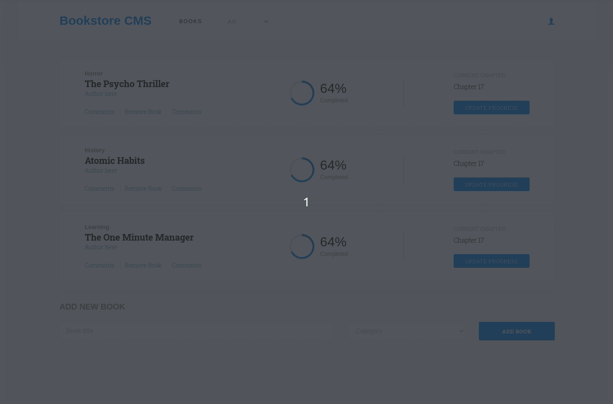

# React Redux Bookstore App

> React/Redux Project to build the front-end of an application to organize and manage a small bookstore.



# Additional description about the project and its features.

## Built With

- React.js, Webpack, Babel
- HTML5/CSS3, Javascript ES6
- ESlint, Stylelint
- VSCode


## Live Demo @Heroku

[Live Demo Link](https://rdx-bookstore.herokuapp.com)


## Getting Started

To get a local copy up and running, follow these simple steps.

Clone or fork the [repo](https://github.com/canriquez/redux-bookstore.git)

*note you need have install npm or yarn.
* [npm](https://www.npmjs.com/get-npm)
* [yarn](https://classic.yarnpkg.com/en/docs/install)

## How it Works

This webpage is built on ES6 & React basis. All of the resources (images, fonts) and .js files are located inside `/src` folder.

## Install

### `yarn start`

Runs the app in the development mode.<br />
Open [http://localhost:3000](http://localhost:3000) to view it in the browser.

The page will reload if you make edits.<br />
You will also see any lint errors in the console.

### `yarn build`

Builds the app for production to the `build` folder.<br />
It correctly bundles React in production mode and optimizes the build for the best performance.

The build is minified and the filenames include the hashes.<br />
Your app is ready to be deployed!

See the section about [deployment](https://facebook.github.io/create-react-app/docs/deployment) for more information.


### Usage

You are provided with a set of booklist to init the app. You are free to delete them and add your new preferred ones. Add as many as you like with the form provided on the footer setting a title and a book category. 

Once you have all of your books set on the list, you can filter them with the navbar category selector.

Refresh to get your app to init again.


### Run tests

*   Run the test suite app for store actions with
    ```
    $ npm test
    ```


## Authors

👤 ***Carlos Anriquez***

- Github: [@canriquez](https://github.com/canriquez)
- Twitter: [@cranriquez](https://twitter.com/cranriquez)
- Linkedin: [linkedin](https://www.linkedin.com/in/carlosanriquez/)
- Portfolio: [carlosanriquez.com](https://www.carlosanriquez.com)

👤 ***Ricardo Valtierra***

- Github: [@ricardovaltierra](https://github.com/ricardovaltierra)
- Twitter: [@RicardoValtie15](https://twitter.com/RicardoValtie15)
- Linkedin: [ricardovaltierra.com](https://www.linkedin.com/in/ricardovaltierra/)


## 🤝 Contributing

Contributions, issues, and feature requests are welcome!

Feel free to check the [issues page](issues/).

## Show your support

Give a ⭐️ if you like this project!

## Acknowledgments

@microverseinc
Family and friends!

## 📝 License

This project is [MIT](lic.url) licensed.
